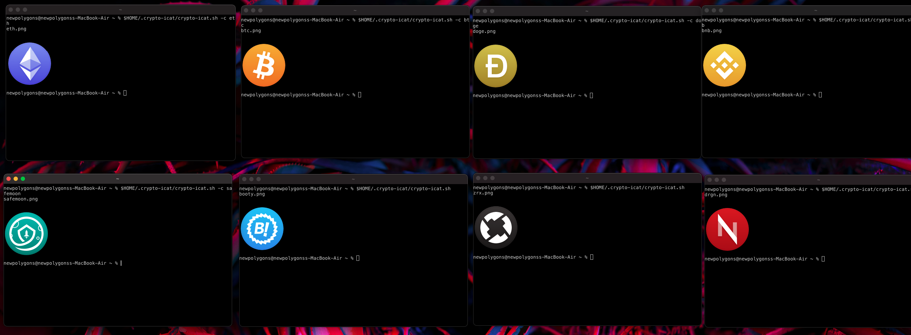

# crypto-icat

This script is inspired by [this project](https://github.com/ph04/pokemon-icat)



## Installation

**Important**: this script currently works only on Kitty, but in [crypto-icat.sh](crypto-icat.sh) you can change this behavior by editing the last line, which shows the picture in the terminal.

To install the script, you must first have all the necessary packages installed:

- Python 3.x
- pip3


After making sure that you have all of these installed, run this command:

```sh
git clone https://github.com/newpolygons/crypto-icat && cd crypto-icat && chmod +x install.sh && ./install.sh
```

which should start the installation process of the script.


## Usage

To show a random crypto, simply run:

```sh
$HOME/.crypto-icat/crypto-icat.sh
```

## Specify Crypto

```sh
$HOME/.crypto-icat/crypto-icat.sh "-c btc"
```
